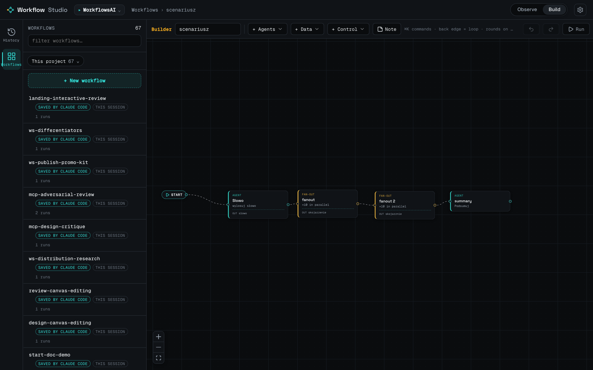

<p align="center">
  
</p>

# Workflow Studio

**A local, no-code builder and observability dashboard for Claude Code's `Workflow` tool — exposed to the agent over MCP.**

**Website:** [szymonpaluch.com/workflow-studio](https://szymonpaluch.com/workflow-studio) · **Install:** `uvx workflow-studio` ([PyPI](https://pypi.org/project/workflow-studio/))


Claude Code's `Workflow` tool is a deterministic multi-agent orchestration primitive — fan-out subagents, pipelines, adversarial review, loops. Workflow Studio gives you two things it doesn't have on its own: a way to **watch** what a run actually did (phases, agents, tokens, timing, which branch was taken), and a way to **author** new workflows visually instead of hand-writing the JS. It then exposes both halves to the Claude Code agent over **MCP**, so you and the agent work through one live surface instead of a script file dropped on disk that the agent can't see.

Everything runs locally. The dashboard binds `127.0.0.1`, reads your local Claude Code data on disk, and makes no network calls — no telemetry.

## Screenshots

> **TODO: add screenshots.** The image references below are placeholders; the files do not exist in the repo yet.

```
      <!-- TODO -->
       <!-- TODO -->
```

## The two halves

### 1. Observe

A React dashboard that reads Claude Code's own on-disk run artifacts (`~/.claude/projects/**/subagents/workflows/wf_*`) and renders each run as a graph/timeline: phases, per-agent nodes, tokens, timing, and which branch was taken. Live runs are included and the view auto-refreshes as a run progresses.

### 2. Author

A no-code block builder (canvas) that compiles to a runnable Workflow script. It emits real Workflow primitives — `agent()`, `phase()`, `parallel()`, `pipeline()`, `log()` — plus a `@wf-builder` sidecar comment so designs round-trip losslessly between the canvas and the generated script.

There are **12 block kinds**:

| Block | What it is |
|-------|------------|
| `agent` | A single agent with a prompt |
| `fanout` | N agents in parallel |
| `loop` | One agent improves the result over N rounds (in place) |
| `subwf` | A nested workflow |
| `gate` | Agent only when a predecessor field meets a condition (0..1) |
| `filter` | Filter a list by an element field — no agent |
| `switch` | Branch on a predecessor enum field value (k-way) — no agent |
| `pipeline` | Each list element flows through the stages independently (no barrier) |
| `rank` | Sort a list by a field and keep the top N — no agent |
| `input` | A fixed list of elements (a source for fan-out/pipeline/ranking) — no agent |
| `param` | A named value (text/path/number) for `@{…}` in prompts — no agent |
| `start` | The entry anchor — no agent. Blocks wired from it are the start; 2+ run in parallel |

## For the agent (MCP)

The package ships a hand-rolled, **dependency-free** JSON-RPC 2.0 stdio MCP server (no SDK, so the package stays zero-dependency and `uvx`-startable with no resolution step). It runs via the `workflow-studio mcp` subcommand and exposes **9 tools**:

| Tool | Kind | What it does |
|------|------|--------------|
| `get_context` | read | The scope this server operates under (launch project, path, current session) plus a doctor view (`dataDir`/`tasksRoot`/`dist`). Call first. |
| `list_projects` | read | Every Claude Code project on the machine with workflow history. |
| `list_runs` | read | OBSERVED runs in the current project (live first, then newest): name, agent count, status, age. |
| `get_run` | read | Full OBSERVED graph of one run: phases, agents, logs, tokens, timing. |
| `list_workflows` | read | Reusable workflows visible in the project (builder designs + workflows observed from runs), with honest `source`. |
| `get_workflow` | read | One workflow by name: its runnable `script`, a decoded `contract` (when `hasSidecar`), and the runs sharing its name. |
| `get_run_design` | read | The DECLARED design a specific run executed: `script` + `source` + decoded `contract`. |
| `save_workflow` | write | Draft a Workflow `script` INTO the human's block builder (appears in `list_workflows`). Returns the path + `editable` flag; refuses to overwrite an existing name unless `overwrite=true`. |
| `promote_run` | write | Promote an existing run into a named, reusable workflow (copies the run's own script). Refuses if the name already exists. |

### Honesty flags (baked into the data)

The project's ethos is not conflating what was *observed* with what was *declared*, so the flags live in the tool payloads, not in prose:

- **Observed run data** (`get_run`, `list_runs`) carries:
  - `taskMatched` — `false` means the overlay was garbage-collected and the metrics are **heuristic/unknown, not measured**.
  - `status` — `live` or `incomplete` means the elapsed span is a **lower bound**, not a final measurement.
- **Declared designs** (`get_workflow`, `get_run_design`) carry:
  - `source` — `'snapshot'` = exactly what ran, `'template'` = a mutable fallback that **may differ** from what ran, `null` = none recorded.
  - `hasSidecar` + a decoded `contract` (declared inputs + per-agent output schema + block/edge skeleton). `hasSidecar=false` means the structure is **best-effort recovery, not a faithful design**.

### The server cannot start a run

It hands the agent a design's `script`; the agent runs that script with its **own** `Workflow` tool. There is no path by which this server injects a run into your session.

## Why MCP — the collaboration story

Without this, the only human↔agent channel is a script file dropped on disk that the agent is blind to. The MCP server turns it into a live two-way surface: the agent discovers what you built in the builder, reads a design's declared contract, runs it with its own `Workflow` tool, inspects the resulting observations, and drafts designs back into your builder for you to review and refine. One surface, both directions.

## Install

Requires [`uv`/`uvx`](https://docs.astral.sh/uv/) on your `PATH`. The package is published on PyPI as
[`workflow-studio`](https://pypi.org/project/workflow-studio/) — nothing to build.

### Plugin (recommended)

```
/plugin marketplace add hculap/workflow-studio
/plugin install workflow-studio@workflow-studio
```

Then `/mcp` lists `workflow-studio` (9 tools) and `/workflow-studio:dashboard` opens the UI. The plugin
launches the MCP server with `uvx workflow-studio mcp`, pulling the package from PyPI.

### Local dev (from a checkout, before pushing the marketplace repo)

```
/plugin marketplace add /absolute/path/to/plugin-marketplace
/plugin install workflow-studio@workflow-studio
```

### MCP server only (no plugin)

```
claude mcp add workflow-studio -s user -- uvx workflow-studio mcp
```

### Dashboard (standalone)

```
uvx workflow-studio
```

## Status

The package is **live on PyPI** — `uvx workflow-studio` and `uvx workflow-studio mcp` work today. The
Claude Code plugin marketplace is served from this repo, so `/plugin marketplace add hculap/workflow-studio`
works once the repo is pushed to GitHub (until then, use the local-path form above). `v0.1.0`, MIT.

## Gotchas

- **Shared data directory.** `save_workflow` / `promote_run` write to `WORKFLOW_STUDIO_DATA` (default `~/.local/share/workflow-studio`). The human's dashboard must read the **same** directory or the agent's drafts won't appear in the builder. Both default to it when run via `uvx`; running the dashboard from a source checkout writes to the repo root instead. `get_context` reports the resolved `dataDir` so you can diagnose a mismatch.
- **`uvx` must be on `PATH`.** A GUI-launched Claude Code may not inherit it, in which case the MCP server shows `failed` in `/mcp`.

## Repo layout

```
.claude-plugin/marketplace.json
workflow-studio/
  .claude-plugin/plugin.json
  skills/workflow-studio/SKILL.md
  commands/dashboard.md
README.md   LICENSE   CHANGELOG.md   .gitignore
```

## Uninstall

```
/plugin uninstall workflow-studio@workflow-studio
/plugin marketplace remove workflow-studio
```

If you added the MCP server directly (without the plugin):

```
claude mcp remove workflow-studio -s user
```

To remove drafted workflows and cached data, delete `WORKFLOW_STUDIO_DATA` (default `~/.local/share/workflow-studio`).

## License

MIT © 2026 Szymon Paluch &lt;hculap@gmail.com&gt;

Website: https://szymonpaluch.com/workflow-studio · Source &amp; issues: https://github.com/hculap/workflow-studio
